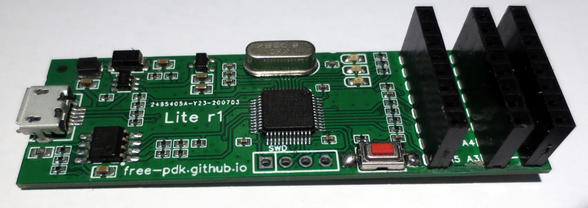
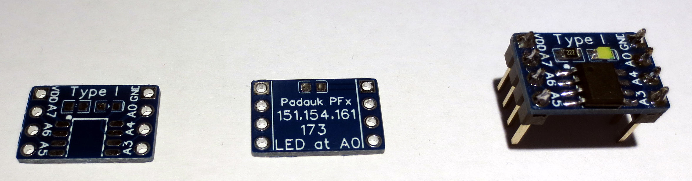
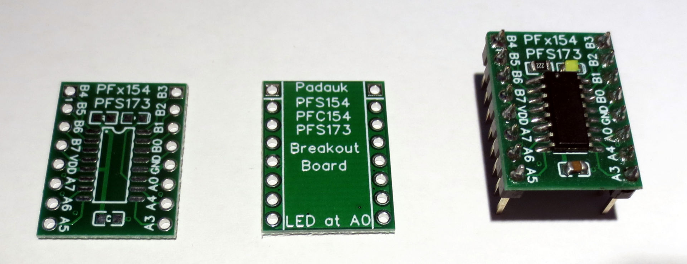

# Easy-pdk-programmer Lite r1 Hardware

### WORK IN PROGRESS ### 

This is a modified version of the [easy-pdk-programmer](https://github.com/free-pdk/easy-pdk-programmer-hardware) with then goal to allow automated assembly using the JLCPCB assembly service. The component selection was tailored to fit the component selection available at the supplier, allowing for an economical way of obtaining a Free-PDK programmer without the need to solder small SMD components. Only a few larger components have to be added by manual soldering at a later time.

A brief summary of changes that were made:

- The BOM was modified use "Basic" components from JLCPCBs parts library where possible.
- All passive components were changed to 0402 parts where possible to save PCB space and cost
- The power supply circuitry was simplified while retaining functionality of the original
- An optional third header was introduce to allow directly plugging in break-out-boards into the programmer

More detailed information can be found in the [Design Log](/Design_log.pdf). The schematics can be found [here](Schematics/Schematic_EasyPDKPROGlite_2020-07-26_13-36-43.pdf).

Please note that this version of the programmer is not meant for manual assembly. 

# Ordering instructions

Ordering instructions will be added later

# Assembly instruction

Assembly instructions will be added later. Please refer to the [Design Log](/Design_log.pdf) for now

# Breakout boards

